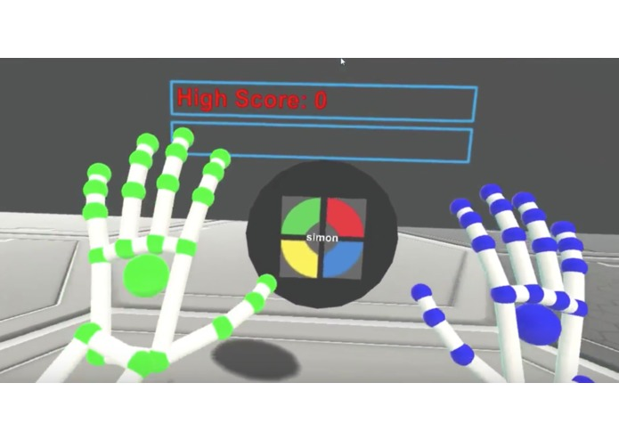

I was fortunate enough to be able to participate in the Tech Valley AR/VR Gaming Hackathon in Troy, New York. It was incredible to be able to experiment with the various virtual reality technologies like the <a href="https://www.oculus.com" target="_blank">Oculus Rift</a>, the <a href="https://www.htcvive.com" target="_blank">HTC Vive</a> and <a href="https://www.leapmotion.com" target="_blank">Leap Motion controller</a>. I made an entry with the <a href="https://unity3d.com" target="_blank">Unity game engine</a> called RalphVR that is a recreation of the handheld electronic memory game simon in virtual reality. My entry which won Best Game is documented <a href="http://devpost.com/software/simonvr" target="_blank">here</a>.
