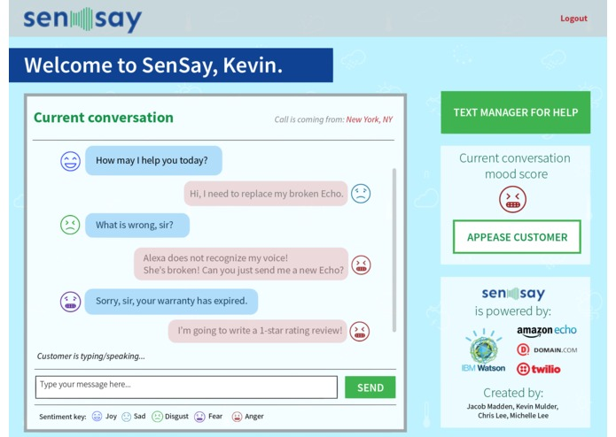

I competed in the 24-hour hackathon at TechCrunch Disrupt NY 2016. It was amazing seeing a gigantic room full of people coding throughout the night. The venue was amazing at the Brooklyn Cruise Terminal. We enjoyed exploring various technologies including Amazon Alexa. With no sleep presenting on the large stage to thousands of people was exhilarating.

Our team decided to build SenSay, a customer service rep real-time dashboard that provides feedback of the support conversation that he/she is having, with IBM Watson identifying the sentimental tones of the dialogue and the user personality insights. Whether it is through the on-screen chat or voice (using Amazon Echo), SenSay recognizes the mood expressed in the user's language. We wrote a nodejs web server using express.js and augmented with socket.io for real-time communication and updating between the server and clients. We used the Amazon Alexa Skill API for interfacing with the Amazon Echo, which calls AWS Lambda to trigger the sentiment analysis. We also integrated Twilio as part of a two-way text messaging (SMS) feature. Overall, we integrated a lot of features in a very short perioud of time for a cohesive solution. Here are more details about the <a href="https://devpost.com/software/sensay" target="_blank">SenSay entry</a>.
