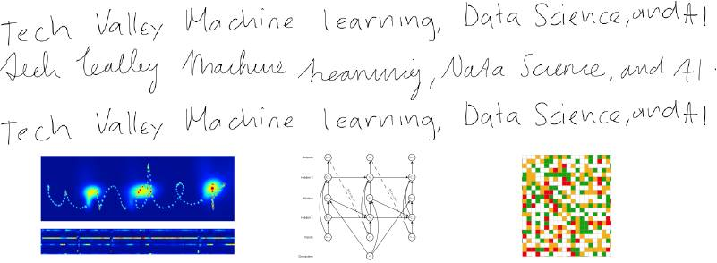
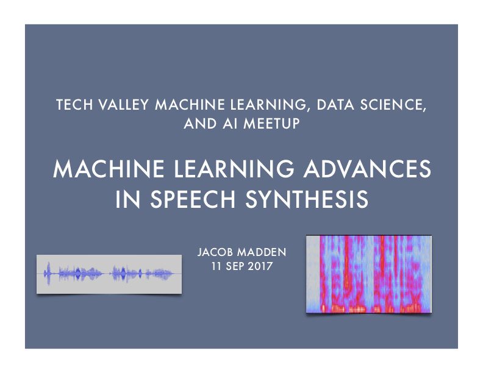

With the organizer of the <a href="https://www.meetup.com/Tech-Valley-Machine-Learning-and-AI" target="_blank">Tech Valley Machine Learning, Data Science, and AI meetup</a>, Dan Elton, leaving the area for a post-doc position, I decided to step in as organizer to keep things going and explore the latest machine learning advances with the Troy, Latham, Colonie, Clifton Park, Schenectady and Albany community that makes up Tech Valley.

To start things off, I presented a session on the latest <a href="https://www.meetup.com/Tech-Valley-Machine-Learning-and-AI/events/242851799/" target="_blank">Machine Learning Advances in Speech Synthesis</a>. We explored together the history of synthetic speech and moved into the details of machine learning approaches used by Apple's Siri, Google's Tacotron, Deepmind's WaveNet, Baidu's Deep Voice and Deep Voice 2. We had a great turnout with a lot of enthusiasm and it was terrific.

I also started a <a href="https://www.facebook.com/groups/TechValleyMachineLearningDataScienceAI" target="_blank">Facebook group</a> to share the latest articles more often.
