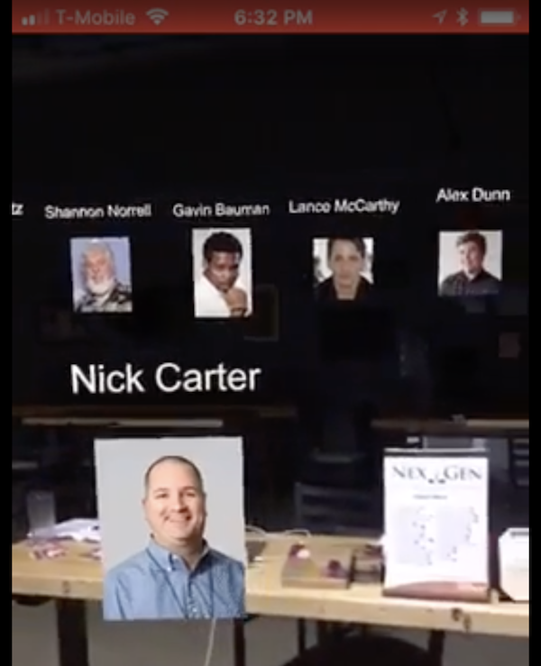

I participated in the <a href="https://realityvirtuallyhack.com/" target="_blank">2017 Reality Virtually Hackathon</a> at MIT Media Lab, the largest-ever immersive hackathon on virtual reality (VR) and augmented reality (AR) and attracting sponsors like Samsung, Microsoft, AT&T, Google, Meta and HTC VIVE. The learning sessions were fantastic. I especially enjoyed the sessions by Merge Cube, Mapbox and NVIDIA.

In preparation for the event and to learn more about the mentors and judges, I came up with an idea for ARKit where the biographies and photos of each judge could be spread out around the user in a circle and navigated through swiping. I put together a prototype and shared the following video with the group. I was super happy when during the launch event in a large auditorium at MIT one of the organizers gave me a shout out for the idea.

`youtube:https://www.youtube.com/embed/TS4MfGW4TH0`
