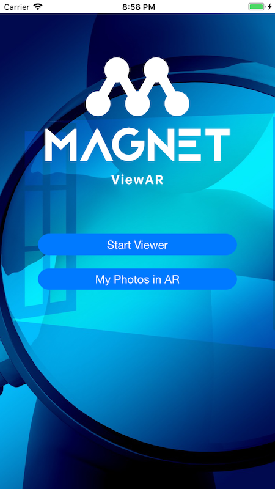
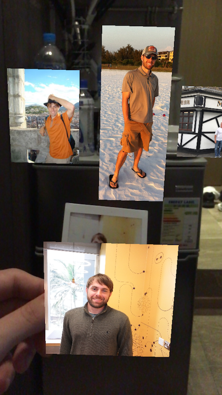
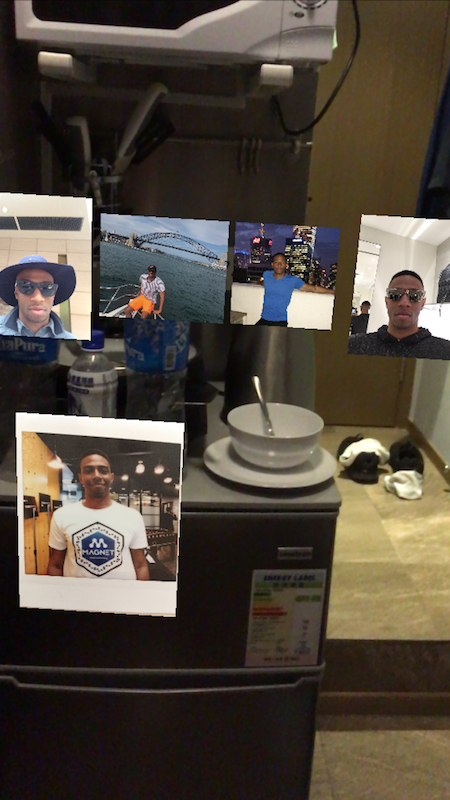

In our startup we created a really interesting augmented reality app for iOS devices. We used ARKit, Swift, the Vision Framework and MLCore. Image targets are able to launch unique augmented reality experiences including an AR photo spread, play an animated GIF, play a video or play a 360 video. Find it on the App Store <a href="https://itunes.apple.com/us/app/magnet-viewar/id1369823423?mt=8" target="_blank">here</a>.

At events, Scott bought a camera that takes Polaroid photos that we handed out to people who attended. The photo then launches an AR photo spread of photos for that person. Above is my example and below is Scott's.

