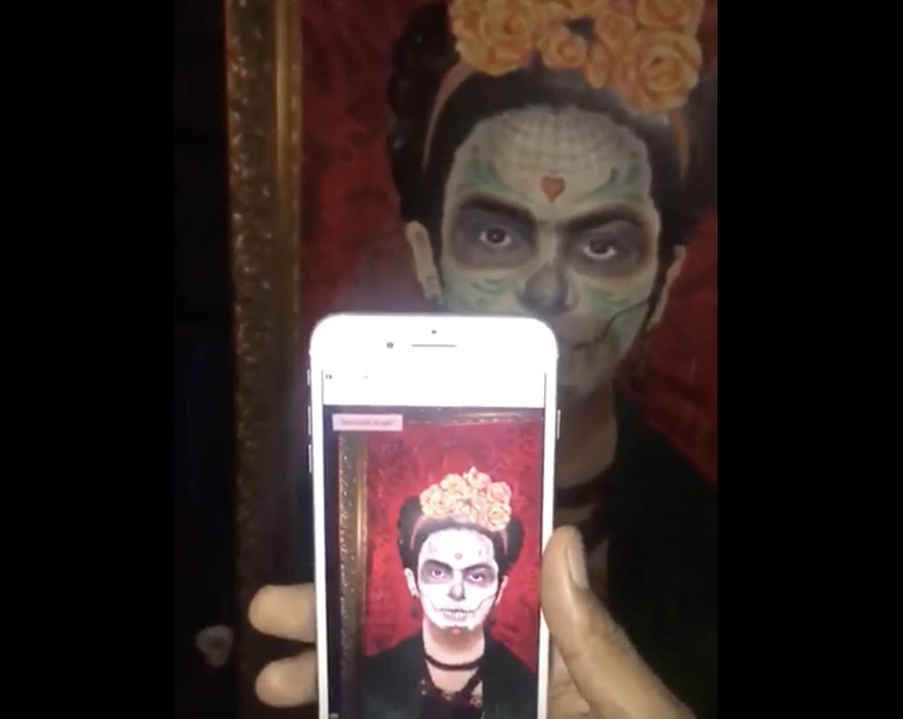

An augmented reality painting experience created for a restaurant event in Hong Kong added to our Magnet ViewAR iOS app. The user points their phone at the painting. The painting is recognized and an overlay augmented reality experience plays welcoming users to the restaurant.

`youtube:https://www.youtube.com/embed/KEyXqLvVwcQ`
