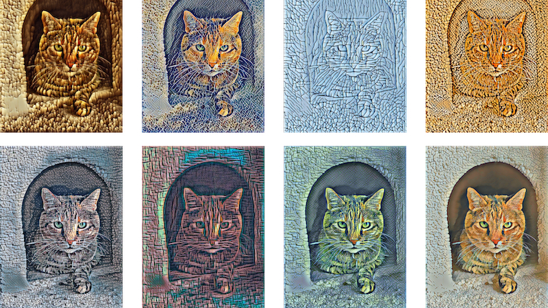

Late last year, Apple released <a href="https://github.com/apple/turicreate" target="_blank">Turi Create</a> open source to the public. Turi Create (formerly GraphLab Create) is a toolset for creating machine learning models for tasks such as image classification, object detection, style transfers, recommendations, etc. The output of the models is in CoreML form, ready to be used by an iOS app. I reviewed Turi Create at our <a href="https://www.meetup.com/Tech-Valley-Machine-Learning-and-AI/events/254281904/" target="_blank">meetup</a> using Google Colab notebooks to demonstrate the various examples of machine learning applications.

The Google Colab notebooks can be found and used on .

* photo from Turi Create user guide: <a href="https://apple.github.io/turicreate/docs/userguide/style_transfer/">https://apple.github.io/turicreate/docs/userguide/style_transfer/</a>
