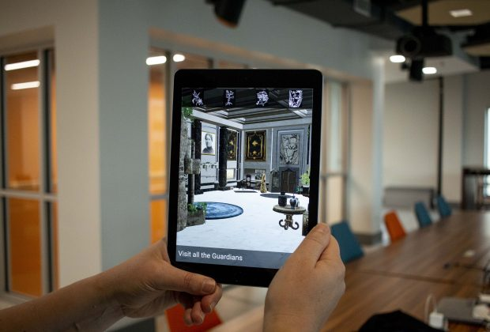

For the <a href="http://wizardingweekend.com" target="_blank">Wizarding Weekend</a> in 2018 in Ithaca, Becky Lane of VisionLab360 and I decided to create an augmented reality portal experience to go along with the in-person quests throughout the weekend. We had over 300 people come and walk through the New Roots School lobby at the historic Clinton House, stepping into the magical world of the <a href="http://wizardingweekend.com/gorgekeep/" target="_blank">GorgeKeep School of Magic</a>. Users walk around the room with their mobile device as their viewer and visit each of the four Guardian stations. With the help of Ithaca voice actors reading dialogue that Becky scripted, the Guardians truly came alive for attendees.

The app works on both Apple and Android mobile devices using ARKit and ARCore respectively. It was developed in Unity.

The Ithaca Voice article <a href="https://ithacavoice.com/2018/10/step-into-gorgekeep-this-wizarding-weekend-with-augmented-reality-experience/" target="_blank">Step into GorgeKeep this Wizarding Weekend with augmented reality experience</a>

Tompkins Weekly article <a href="http://tompkinsweekly.com/stories/bringing-the-magic-to-life,2035" target="_blank">Bringing the magic to life</a>

<a href="https://itunes.apple.com/us/app/gorgekeep-portal/id1437098788?mt=8" target="_blank">iOS app</a>
<a href="https://play.google.com/store/apps/details?id=co.jmadden.gorgekeep.portal" target="_blank">Android app</a>
