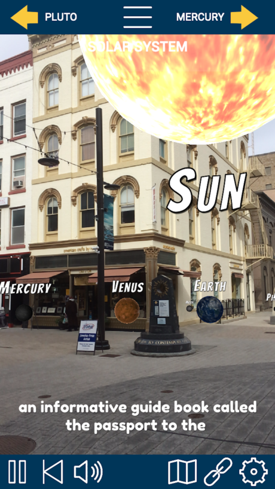

With my friend Becky Lane of VisionLab360 we worked with the Ithaca Sciencenter to create an augmented reality experience for their refresh of the popular <a href="https://saganplanetwalk.com/" target="_blank">Sagan Planet Walk</a> that starts in the Ithaca Commons. Bill Nye The Science Guy, a Cornell alum like Carl Sagan, had previously recorded a narration for the planet walk that was available by calling a phone number while doing the walk. We took the audio and put it in our app. At each station, users can look at the planet in augmented reality, walking around it, changing its size and location, while listening to the narration with facts about the planet. It was truly an honor to be apart of such a fun experience that people use every day.

The app works on both Apple and Android mobile devices using ARKit and ARCore respectively. It was developed in Unity.

Lansing Star article <a href="https://www.lansingstar.com/around-town-archive/15683-new-augmented-reality-features-in-sagan-planet-walk" target="_blank">New Augmented Reality Features in Sagan Planet Walk</a>

Tompkins Weekly article <a href="http://tompkinsweekly.com/stories/bringing-the-magic-to-life,2035" target="_blank">Bringing the magic to life</a>

<a href="https://itunes.apple.com/us/app/saganplanetwalkar/id1439835048?mt=8" target="_blank">iOS app</a>
<a href="https://play.google.com/store/apps/details?id=com.saganplanetwalk.ar&hl=en" target="_blank">Android app</a>
