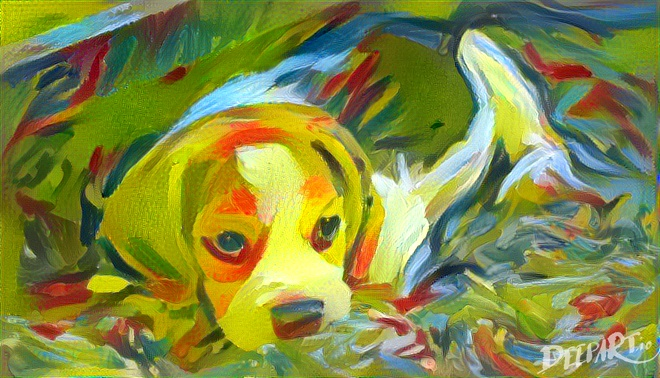

After applying, I was invited to the AT&T Mixed Reality Hackathon with Magic Leap where developers, designers, storytellers and creators explored the world of Spatial Computing for a weekend in San Francisco, California.

`youtube:https://www.youtube.com/embed/JgAJ3n6ylA8`

At the hackathon we got hands-on development time with the Magic Leap One and technical mentorship on our projects. Here is a writeup of my experience building a <a href="https://devpost.com/software/mixed-reality-pet" target="_blank">Mixed Reality Pet</a>.
