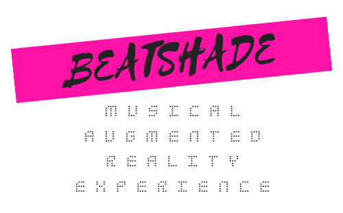

Created for the Bose AR + Capital Factory <a href="http://info.capitalfactory.com/bosepitch" target="_blank">2019 Pitch Competition</a>.

Beatshade is a BoseAR app idea that lets you create and mix music with your head movements (gestures and spatial movements), using loops and sound fx like a head-driven drum machine. Advanced mode lets the user try to mimic sounds by moving their head to more and more complex patterns.

`youtube:https://www.youtube.com/embed/Oi85i2Zpzf8`
