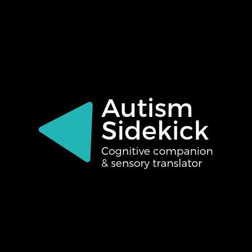

Autism Sidekick is a project focused on granting super powers to people living with ASD using augmented reality (AR). Powered by the Unity engine, the Autism Sidekick is an entry in the 2019 Unity for Humanity Challenge. It is an open-source effort to build a cognitive companion and sensory translator.

`youtube:https://www.youtube.com/embed/bH6RDs4iTjQ`

You can learn more at the website at <a href="https://www.autismsidekick.com/" target="_blank">Autism Sidekick website</a> and by reading the pitch deck at <a href="https://s3.amazonaws.com/autism-sidekick/2019UnityforHumanity_AutismSidekick.pdf" target="_blank">Autism Sidekick pitch deck</a>.
