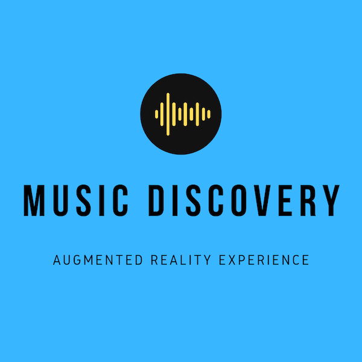

Explore music in an augmented reality experience.

In March, I flew out to Austin, Texas, and participated in the SXSW 2019 Hackathon focused on Music, VR/AR, AI and blockchain. This was a high-energy 24-hour event hosted at the Omni Hotel Downtown in the middle of the now massive SXSW Conference and Music Festival. It was fascinating to learn more about how the music industry works during the introduction by executives and team from Universal Music Group.

For the experience I built, the user enters an augmented reality portal and walks around visiting areas that display musical artist material such as album covers, side passions, etc. When they walk close to an area, a song is triggered and begins to play, with content retrieved through the 7digital API and offered by Universal Music Group. If the user walks away the song gets quieter and if they get far enough the song stops playing. The hackathon version is meant to set the vision for a space of experiences driven by advances in augmented reality capabilities of iOS and Android devices in the hands of millions of fans.

`youtube:https://www.youtube.com/embed/-rCO2bzuyDk`

I see the addition of spatial audio and exploring spaces physically to hear a variety of songs to be a very powerful and interesting medium to experience music. With the broad API capabilities offered by the hackathon sponsors, I saw an avenue for utilizing interesting auditory and visual assets to pave the road for incredible interactive and collaborative experiences for fans in the future that can form a new channel for artist discovery and fan engagement.

You can learn more at the full <a href="https://devpost.com/software/musicdiscoveryar" target="_blank">Devpost writeup</a>.
