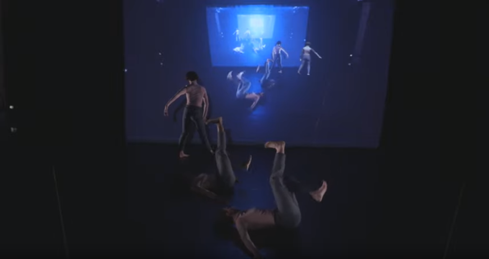

I had a lot of fun collaborating with my friend Ty Turley on a live dance performance called Uneven and Odd where three dancers on stage were tracked with a Microsoft Azure Kinect sensor. I was in awe of Ty's ability to create the choreography of the dance, design the dancer costumes, create the super interesting musical score and even scan the dancers into 3D models that I could then animate in Unity. The piece ran for three nights in a program at Hunter College and each night was a full house.

`youtube:https://www.youtube.com/embed/ORECGKuRbXQ`

From the technical side of things, we wanted to perform skeleton tracking on each of the three live dancers such that we could animate avatars to perform live and recorded dance motions. Microsoft provides a Body Tracking SDK with the Azure Kinect and we built on Rumen Filkov's fantastic <a href="https://assetstore.unity.com/packages/tools/integration/azure-kinect-examples-for-unity-149700" target="_blank">Unity asset</a> to perform the needed record and playback features needed for three dancers. I was able to abstract a manager script with time queues that Ty go edit to activate various avatar capabilities related to the choreography. These included: mirroring the avatars to the real dancers, overlapping the dancers, offsetting the real dancers and variations on record and playback at different speeds.

The output of the processed tracking and avatar control was overlaid on top of the color camera feed from the Azure Kinect sensor and this output was projected behind the dancers. With the avatars being digital scans of the three dancers, they were all essentially dancing with themselves. At times this produced a very surreal effect were you would lose track of which were the real ones and which were the avatars. Lastly, due to the on-the-fly processing, each performance was unique and different. This made it all the more thrilling and enjoyable to watch the performances.

You can see more of Ty's work at <a href="http://www.tyturley.com/dance.html" target="_blank">his website</a>.
