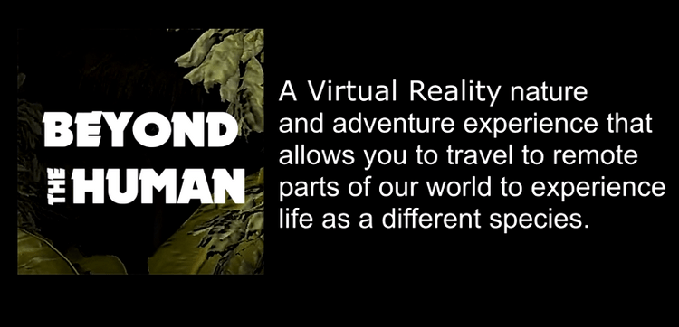

My friend and super talented collaborator Becky Lane gathered a team of amazing folks around an idea of an adventure nature program in virtual reality called Beyond the Human. She had been pitching the deck for it around and got accepted into the 2019-2020 Oculus launchpad program to run with it. The idea is to allow users to travel to remote parts of our world to experience life as a different species. Using virtual reality and high-quality spatial audio and processing, we wanted to share how the tropical forest looks and sounds to creatures like the katydid. We wanted to give people the visceral feeling of being hunted by a bat, with pulsing ultrasonic waves mapping out the environment. The amazing acoustic biologist Laurel Symes is a scientist that actually goes out and studies the forest down in Panama, climbing trees and capturing audio samples. The ever talented Bill McQuay, Eco Location Sound independent audio producer, NPR contributor and National Geographic Explorer, has also joined Laurel on these adventures to capture wonderful forest soundscapes. As a demonstration of what our future vision entailed, we created an experience to reproduce one of the team's visits down to Panama in virtual reality with Laurel as the guide.

<iframe src="https://player.vimeo.com/video/388755507" width="640" height="360" frameborder="0" allow="autoplay; fullscreen" allowfullscreen></iframe>

<a href="https://vimeo.com/388755507">Beyond the Human Demo</a> on <a href="https://vimeo.com">Vimeo</a>.

The demo shows basic gameplay and functionality, using placeholder sounds and images until custom high quality assets can be created with some funding assistance. You start the experience in the field station where you meet a hologram of Laurel explaining where you are. Then you don a headlamp and head out at dawn to the forest, climbing down steps to a large tree you climb to place a special microphone in the tropical canopy so you can listen to captured sounds of katydids adjusted and slowed down for us humans. After that you start a bat echolocation experience where Laurel explains how bats use their sonar abilities to hunt prey. Finally, you continue on down the path to the pond and listen to the frog chorus, learning how frogs use sound to find mates and territories. There is much more to the vision with many species of katydid to learn about along with how essential they are to our forest ecoysystem and how bioacoustics can help measure the health of the forest.

This project was my most challenging VR endeavor yet and was thrilling to work on especially with such talented people and for such a good cause. The more we can share awareness and fill people with a deep sense of awe, the better chance we have of improving our presence on the planet.

Becky is up to a lot but you can find more about her work at <a href="http://visionlab360.com/" target="_blank">the VisionLab360 website</a>.
